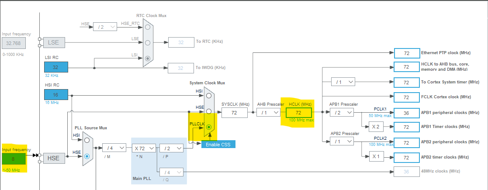
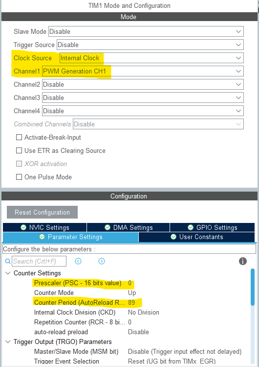
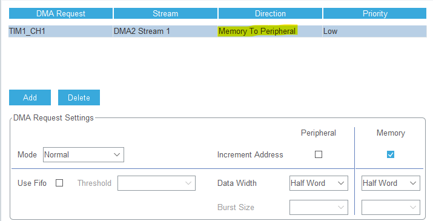

# Настройка проекта

## Clock Configuration
Откройте CubeIDE и создайте новый проект (на языке C). Далее перейдите в Clock Configuration и выставите необходимые значения 

## PWM
Вернитесь в Pinout & Configuration и откройте `System/SYS`. Установите: 

 - Debug: `Serial Wire`.

Теперь перейдите в `Timers/TIM1` и установите: 

 - Clock Source: `Internal Clock`
 - Channel1: `PWM Generation CH1`

В Configuration выставите значения 

 - Prescaler: `0` 
 - Counter Period: `89`

Не выходя из данного меню перейдите в DMA Setting и добавьте новый запрос. В создавшемся запросе поменяйте значение Direction на `Memory To Peripheral`.

# Полезные ссылки:
[Статья](https://controllerstech.com/interface-ws2812-with-stm32/)

[Создание анимаций на светодиодной ленте](https://adrianotiger.github.io/Neopixel-Effect-Generator/)
